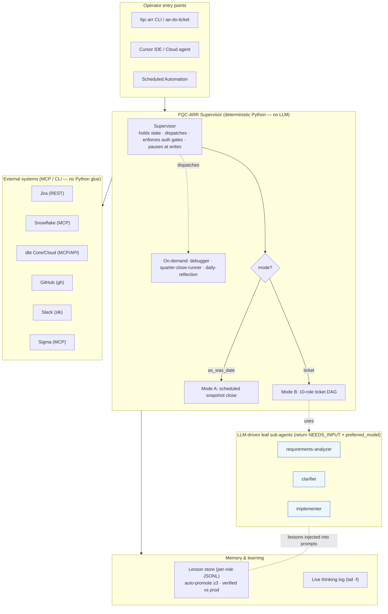
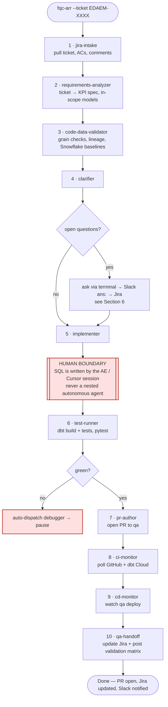
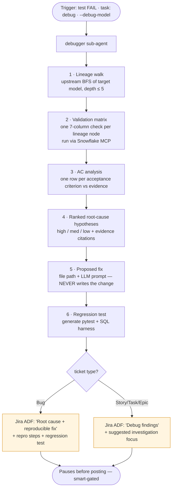
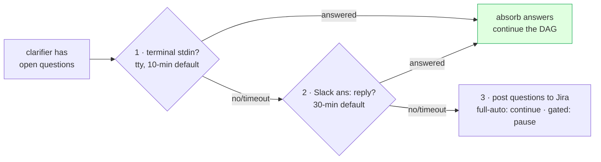
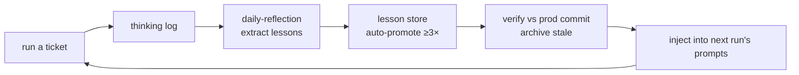

How exactly the cursor helped us for ARR refactoring while supporting FQ closes and 

Net contribution across Phase 2 & 3
Dimension	Before	With agent
Parity validation
Manual ad‑hoc queries
Automated regression on every PR + daily tie‑outs
RCA on discrepancies
Hours/days
Minutes (isolate to a function/model)
Hotfix turnaround
1–2 weeks
< 48 h
Cutover evidence
Manual spreadsheets
Auto‑generated reports/reconciliations + Jira/Slack
Legacy decommission risk
High
Controlled — rollbacks, governance audits, < $1 tie‑out

How this agent delivered quick + accurate turnaround for FQ close activities 
RCA in minutes, not days — traced the $51.8M "backwards term" issue through 400+ models to the exact term_start = execution_date CASE in stg_em_int_renewal_flags.sql, and proved it was a derivation artifact (94% of dollars had forward raw terms; 176/176 reproduced) — then confirmed it was correct business behavior (backdated/never‑paid), avoiding an unnecessary "fix."
Automated daily validation — parity test suite + runbook + macro comparing finance_prod to baseline every day, so close drift is caught continuously instead of manually.
Programmatic Excel/report generation — multi‑sheet gap analyses, reconciliations, and per‑account NRR/GRR compares built with openpyxl in one pass (vs manual spreadsheet assembly).
End‑to‑end PR assurance — verified NRR/GRR flag wiring across the full DAG, triaged Copilot (2 valid / 3 false‑positive with macro‑level proof), ran the PII scan (all‑clean), and posted findings to the PR + Jira with reviewers tagged.
CI/CD + comms automation — monitored QA CI / CD runs with timed Slack updates and Jira write‑backs, compressing coordination overhead during close.

# FQC-ARR Agent — 30-Minute Demo Talking Points & Presenter Script

**Audience:** Mixed — analytics-engineering peers + Finance/Data leadership
**Goal:** Explain what the agent is, how it's architected, how it runs a real ticket end-to-end (build *and* debug), and the value it has delivered.
**Format:** Presenter script with timeboxes, embedded diagrams, and "say-this" lines. Diagrams are Mermaid — they render in Cursor, GitHub, and most markdown viewers.

> **How to use this doc:** Each section has a timebox, the slide/visual to show, and bolded **SAY:** lines you can read aloud or paraphrase. Numbers for the impact section are intentionally left as placeholders — drop your live figures into the `[__]` slots when you present.

---

## Timebox at a glance (30 min = ~24 min content + ~6 min Q&A)

| # | Section | Time |
|---|---|---|
| 1 | Opening hook + what it's meant for | 3 min |
| 2 | Architecture overview (diagram) | 5 min |
| 3 | Flow A — a NEW ticket, end to end (diagram) | 6 min |
| 4 | Flow B — a DEBUGGING ticket (diagram) | 4 min |
| 5 | The sub-agents and their use cases | 3 min |
| 6 | Clarifications — how the agent asks & resumes (Slack) | 2 min |
| 7 | Jira integration — tickets in, progress out | 1 min |
| 8 | Impact over the last 3 months (your numbers live) | 2 min |
| 9 | Continuous learning — the differentiator | 1 min |
| 10 | Close + roadmap | 1 min |
| — | Q&A | ~6 min |

---

## SECTION 1 — Opening Hook + What It's Meant For (3 min)

**Visual:** Title slide — "FQC-ARR: an autonomous Analytics Engineer for the ARR quarter close."

**SAY (the problem):**
- "Every quarter close, the analytics-engineering team does the same high-cognitive, highly-repeatable work: build and refresh the ARR models, validate ARR / ACV / NRR / GRR, reconcile every dashboard, then write it all up in Jira before sign-off."
- "It's exactly the kind of work that's too important to skip and too repetitive to enjoy — same SQL patterns, same dashboards, same edge cases, every quarter."

**SAY (what it is):**
- "FQC-ARR — Finance ARR Quarter Close — is an autonomous agent that runs that workflow the way a senior AE would: it reads the ticket, validates against the warehouse, asks for clarification when the requirement is fuzzy, implements, tests, opens the PR, watches CI/CD, and hands back to QA on Jira."
- "It's built as a **Supervisor + specialist sub-agents** — one coordinator and twelve specialist sub-agents (plus a daily reflection pass that powers the learning loop) — and it gets smarter every run through a verified lesson store."

**Live numbers (as of Aug 2026):** 353 verified lessons | 28 promoted to stable | 128 thinking-log runs | 99 daily reflection passes | 18 specialist roles | 31 cross-project dbt stubs | Full E2E verified across all 12 sub-agents.

> **See also:** `fqc_arr_team_demo_2026_08_06.md` for the 5-section version covering: what the agent is, how it drove the refactoring, how it filled the knowledge gap during quarter closes, productivity multiplier metrics, and the evolution into an autonomous AE agent.

**One-line pitch (put on the slide):**
> "A senior Analytics Engineer that works the full ticket lifecycle — intake to QA hand-off — pausing only where human judgment actually matters."

**What it is *meant* for (be explicit — sets scope for the room):**
- ✅ Ticket-driven changes to the ARR finance models (build, fix, extend)
- ✅ The scheduled quarter-close pipeline run + reconciliation
- ✅ Root-causing data-quality bugs in the ARR lineage
- ❌ *Not* a replacement for AE judgment on metric definitions, stakeholder calls, or strategic platform decisions — those stay human, by design.

---

## SECTION 2 — Architecture Overview (5 min)

**Visual:** the architecture diagram below.

**SAY (the one big idea):**
- "The Supervisor is pure, deterministic Python — it runs *no* LLM itself. It holds state, dispatches sub-agents in order, enforces approval gates, and pauses for humans at write boundaries. That's deliberate: the control flow is auditable and reproducible; the LLM reasoning is isolated to three leaf sub-agents."
- "Everything the agent touches — Jira, Snowflake, dbt, GitHub, Slack — it reaches through MCP or a thin CLI, not bespoke Python glue. That keeps tool calls fast and the surface auditable."

**SAY (walk the layers, 30s each):**
1. **Entry points** — same agent, four runtimes: CLI / `ae-do-ticket` wrapper, Cursor IDE, a scheduled automation, and (later) Workday SANA. The logic never changes; only the runner does.
2. **Supervisor** — the brain-stem. Two modes: **Mode A** runs the scheduled dbt close for a snapshot date; **Mode B** runs the 10-role ticket DAG. Three sub-agents are on-demand, dispatched on failure or by command.
3. **LLM leaves** — only three sub-agents need a model: requirements-analyzer, clarifier, implementer. They don't call a model directly; they emit a prompt + a `preferred_model` and hand back to the runtime (Cursor session, etc.).
4. **External systems via MCP/CLI** — sub-second, typed, auditable.
5. **Memory** — every run writes a thinking log you can `tail -f`, and a lesson store that grows and is verified against production code.

**SAY (the safety story — leadership cares):**
- "There's an authorization dial — `smart_gates` is the default and pauses before every side-effecting write; `full_auto` is opt-in. Nothing reaches production without passing the same gates a junior AE's PR would."

---

## SECTION 3 — Flow A: A NEW Ticket, End to End (6 min) ★ core of the demo

**Visual:** the new-ticket flowchart below. Walk it left-to-right.

**SAY (framing):**
- "Here's what happens when I hand the agent a Jira ticket like 'add a SKU-transformation-type column to `arr_line_categories`.' Ten specialist roles run in order. Watch where it works autonomously — and the one red box where it deliberately stops for a human."

**SAY (narrate the 10 roles — keep each to one breath):**
1. **jira-intake** — reads the ticket, flattens the description, extracts acceptance criteria and comments.
2. **requirements-analyzer** — turns prose into a KPI spec (definition, formula, grain, currency, source of truth) and lists the in-scope dbt models.
3. **code-data-validator** — checks grain integrity, walks lineage, and pulls baseline numbers from Snowflake so we know what "correct" looks like before changing anything.
4. **clarifier** — if anything's ambiguous, it asks (more on this in Section 6). If not, it moves on.
5. **implementer** — *this is the human boundary.* The agent stages the change, but the actual SQL is written in the Cursor session — no nested autonomous agent editing production code. **(Emphasize this — it's the trust anchor.)**
6. **test-runner** — runs the dbt build + the `not_null` / `accepted_values` / waterfall-balance tests + pytest. On failure it auto-dispatches the debugger.
7. **pr-author** — opens the PR to the `qa` branch with a structured body.
8. **ci-monitor** — polls GitHub + dbt Cloud, posts "X of N models complete" heartbeats to Slack.
9. **cd-monitor** — watches the qa deployment.
10. **qa-handoff** — updates Jira with progress and the final validation matrix, ready for human QA.

**SAY (the punchline):**
- "Everything except that one red box runs without me. I write the SQL — the part that needs judgment — and the agent does the intake, validation, testing, PR, monitoring, and the Jira write-up around it."

**Live moment (optional, 60s):** show a real run's thinking log scrolling (`tail -f runs/thinking/<ts>.md`) or the PR + Jira comment the agent produced for a real ticket (e.g. EDAEM-3183).

---

## SECTION 4 — Flow B: A DEBUGGING Ticket (4 min)

**Visual:** the debugging flowchart below.

**SAY (framing):**
- "The second thing it does brilliantly is root-cause. When a metric looks wrong, the debugger sub-agent runs — either automatically when a test fails, or on demand with `task: debug` in Slack, or `--debug-model`."

**SAY (the proof point — use a real one):**
- "Real example: a $22K NRR variance on one account that two Sigma dashboards reported differently. The debugger walked the lineage, built the per-stage matrix, and pinpointed it: one view filtered customer lifetime at **product grain**, the other at **account grain** — so a mature customer with a short-lived product got silently dropped. It proposed the one-line fix and a regression test."
- "Agent time: minutes. Human time for the same trace: a few hours of code-reading and SQL profiling."

**SAY (the trust line):**
- "Notice step 5 — it proposes the fix and the prompt, but it does **not** write it. And it pauses before posting to Jira. Read-mostly by default."

---

## SECTION 5 — The Sub-Agents and Their Use Cases (3 min)

**Visual:** this table (one slide — don't read every row, point to a few).

**SAY:** "Each role is a specialist with one job. Here's the full roster and when each earns its keep."

| # | Sub-agent | What it does | Use case it solves |
|---|---|---|---|
| 1 | **jira-intake** | Pulls ticket, ACs, comments | "Start from the source of truth, not a paraphrase" |
| 2 | **requirements-analyzer** ⟢ | Prose → KPI spec + in-scope models | "Turn a vague ask into a testable spec" |
| 3 | **code-data-validator** | Grain checks, lineage, Snowflake baselines | "Know what 'correct' is *before* changing code" |
| 4 | **clarifier** ⟢ | Surfaces open questions, collects answers | "Don't guess on ambiguous requirements" |
| 5 | **implementer** ⟢ | Stages the change (human writes SQL) | "Human judgment where it matters" |
| 6 | **test-runner** | dbt build + tests + pytest | "Never ship untested model changes" |
| 7 | **pr-author** | Opens PR to qa with structured body | "Consistent, review-ready PRs" |
| 8 | **ci-monitor** | Polls GitHub + dbt Cloud, Slack heartbeats | "No babysitting the CI tab" |
| 9 | **cd-monitor** | Watches qa deploy | "Know the moment qa is live" |
| 10 | **qa-handoff** | Updates Jira + validation matrix | "Clean, documented hand-off" |
| ⊕ | **debugger** | Lineage walk → matrix → ranked root cause → fix | "Root-cause a metric bug in minutes" |
| ⊕ | **quarter-close-runner** | Runs ARR pipeline + 7-check recon matrix | "One-command quarter close + tie-out" |
| ⊕ | **daily-reflection** | Mines runs for lessons, promotes recurring ones | "The agent gets smarter every day" |

> ⟢ = LLM-driven leaf · ⊕ = on-demand (not in the linear DAG)

---

## SECTION 6 — Clarifications: How the Agent Asks & Resumes (2 min) *(separate section, by request)*

**Visual:** the resolution-order strip below.

**SAY (why this matters):**
- "The single biggest source of friction in any AE workflow is unclear requirements. So clarification is a first-class capability, not an afterthought."

**SAY (how it works):**
- "When the clarifier has open questions, it tries to get answers in this order — and only writes to Jira as a last resort:"

**SAY (the Slack side-channel — the cool part):**
- "While a run is live, the agent polls its own Slack thread. I can steer it or answer it without touching the terminal:"

| Prefix | Example | Effect |
|---|---|---|
| `task:` | `task: pause` · `task: skip clarifier` · `task: debug arr_line_categories` · `task: cancel` | Steer the run mid-flight |
| `ans:` | `ans: 1) USD_HIST  2) 2026-05-11  3) account grain` | Answer the clarifier; the agent absorbs it and continues — **no daemon, the wait runs in-process** |

**SAY:** "So a fuzzy ticket doesn't stop the agent cold — it asks in Slack, I reply in one line, and it keeps going. It never fabricates answers."

---

## SECTION 7 — Jira Integration: Tickets In, Progress Out (1 min)

**Visual:** a simple in/out strip.

**SAY:**
- "Jira is both the input and the system of record for output."
- "**In:** jira-intake reads the ticket, ACs, and comments directly via the Jira REST API."
- "**Out:** sub-agents post role-by-role progress as comments, the clarifier posts questions there when Slack doesn't catch them, the debugger posts a root-cause comment shaped by ticket type — Bug vs Story — and qa-handoff posts the final validation matrix and updates status."
- "Net effect: anyone watching the ticket sees a clean, timestamped trail of exactly what the agent did, with no extra effort from me."

| Direction | What flows | How |
|---|---|---|
| Jira → Agent | ticket summary, description, ACs, comments | REST API (token auth) |
| Agent → Jira | progress comments, clarifier questions, debug root-cause, QA matrix, status transitions | REST API (smart-gated writes) |

---

## SECTION 8 — Impact Over the Last 3 Months (2 min) *(present your numbers live)*

**Visual:** a before/after table — **fill the brackets live.**

**SAY (the qualitative story — this is what the numbers will quantify):**
- "Over the last three months this agent has shifted from a prototype to part of how we actually work the ARR close."
- "It's worked real tickets end-to-end, it's caught production data-quality bugs that were live for months, and it's accumulated a verified knowledge base that didn't exist before."

**Talking points (drop your figures into the brackets):**
- "**Tickets:** the agent has driven `[__]` EDAEM tickets through some or all of the lifecycle — examples include the SKU-transformation column add and the NRR grain-mismatch fix."
- "**Code intelligence:** it mined `[__]` PRs from Feb–Jun to learn our conventions, so its output matches how we already write models."
- "**Bugs found:** `[__]` real reconciliation/data bugs root-caused — including the $22K NRR grain bug that two dashboards disagreed on."
- "**Time saved:** quarter-close reconciliation from `[__]` to `[__]`; per-PR impact analysis from `[__]` to `[__]`; variance investigation from `[__]` to `[__]`."
- "**Knowledge captured:** a lesson store of **353** verified lessons that grows automatically — institutional memory that used to live only in people's heads."

| Workflow | Before | With FQC-ARR | Note |
|---|---|---|---|
| Quarter-close reconciliation | `[__]` | `[__]` | Same SQL, same checks, every quarter |
| PR impact analysis | `[__]` | `[__]` | Reads lineage automatically |
| Sigma↔Snowflake variance hunt | `[__]` | `[__]` | The $22K NRR example |
| Ticket triage + investigation | `[__]` | `[__]` | Intake + validation up front |
| Knowledge capture | usually skipped | automatic | Verified lesson store |

**SAY (the framing that lands with leadership):**
- "The pattern is consistent: the agent takes the **repetitive cognitive load** — investigation, validation, documentation, monitoring — and leaves the **judgment** with the AE."

---

## SECTION 9 — Continuous Learning: The Differentiator (1 min)

**Visual:** the learning loop.

3. How this agent delivered quick + accurate turnaround
RCA in minutes, not days — traced the $51.8M "backwards term" issue through 400+ models to the exact term_start = execution_date CASE in stg_em_int_renewal_flags.sql, and proved it was a derivation artifact (94% of dollars had forward raw terms; 176/176 reproduced) — then confirmed it was correct business behavior (backdated/never‑paid), avoiding an unnecessary "fix."
Automated daily validation — parity test suite + runbook + macro comparing finance_prod to baseline every day, so close drift is caught continuously instead of manually.
Programmatic Excel/report generation — multi‑sheet gap analyses, reconciliations, and per‑account NRR/GRR compares built with openpyxl in one pass (vs manual spreadsheet assembly).
End‑to‑end PR assurance — verified NRR/GRR flag wiring across the full DAG, triaged Copilot (2 valid / 3 false‑positive with macro‑level proof), ran the PII scan (all‑clean), and posted findings to the PR + Jira with reviewers tagged.
CI/CD + comms automation — monitored QA CI / CD runs with timed Slack updates and Jira write‑backs, compressing coordination overhead during close.

**SAY:**
- "Most automation rots — it's written once and drifts from reality. This agent does the opposite."
- "After every run, a reflection pass mines the thinking logs for what worked and what didn't, records it as a one-line lesson, and **auto-promotes** any lesson that recurs three or more times. Those lessons get injected back into the LLM sub-agents' prompts on the next run."
- "And critically — the lessons are **verified against production code**, with a commit stamp. When the codebase changes, stale lessons get archived. That's how we prevent the agent from confidently repeating yesterday's truth."

**SAY (the soundbite):**
- "It's not fine-tuning — it's an auditable, version-controlled memory the agent applies in-context every run. Reviewable in PRs, correctable by a human, and it never silently drifts."

---

## SECTION 10 — Close + Roadmap (1 min)

**SAY (roadmap — 3 bullets max):**
- "Near term: tighter Jira automation and broader ticket coverage."
- "Then: the same Supervisor + sub-agent pattern applied to other domains — Marketing, Sales Ops, CX — each a parallel agent."
- "Ongoing: the lesson store keeps compounding."

**Closing line (put on the final slide):**
> "This isn't AI replacing the Analytics Engineer. It's AI doing the boilerplate — intake, validation, testing, PRs, monitoring, write-ups — so the AE spends their time on the hard, novel, judgment-heavy work. That's exactly the work leadership has been asking us to do more of."

---

## Q&A Cheat Sheet (anticipated questions)

| Q | Short answer |
|---|---|
| **Does it edit production code on its own?** | No. The implementer is a deliberate human boundary — the SQL is written in the Cursor session. The agent stages, tests, PRs, and documents around it. |
| **How do you prevent hallucinations / drift?** | Lessons are verified against production commits and auto-archived when stale. The debugger proposes fixes but never writes them. Writes are smart-gated. |
| **What's the authorization model?** | A dial: `smart_gates` (default) pauses before every write; `full_auto` is opt-in. Same review gate as a junior AE's PR. |
| **What if the requirement is unclear?** | The clarifier asks — terminal, then Slack `ans:`, then Jira. It never guesses. |
| **Audit trail?** | Every run writes a live thinking log; every Jira/Slack/PR action is recorded; lesson changes are version-controlled. |
| **What does it run on?** | Cursor + Claude + MCP. The Supervisor is plain Python; the model only touches three leaf sub-agents. |
| **Can other teams use it?** | Yes — the Supervisor + sub-agent + lessons pattern is portable across domains. |
| **What about SOX / change control?** | Read-mostly by default; any write to a controlled model goes through normal change control. The agent enforces the gate, it doesn't bypass it. |
| **Truly unattended (3 AM, no human)?** | The reasoning/implementer steps pause for a human by design; the scheduled close (Mode A) and monitors run unattended. |

---

## Demo-Day Checklist

- [ ] Architecture diagram on its own slide (Section 2)
- [ ] New-ticket flowchart on its own slide (Section 3)
- [ ] Debugging flowchart + the $22K NRR story ready (Section 4)
- [ ] One real artifact open: a PR + Jira comment the agent produced (e.g. EDAEM-3183)
- [ ] Optional live moment: `tail -f` a thinking log, or post `task: status` in Slack
- [ ] Impact slide with **your real numbers** filled into the brackets (Section 8)
- [ ] Lesson-store count ready (`fqc-arr --show-lessons` or `ls .../lessons | wc -l`)
- [ ] Practice the two flows once — 6 min + 4 min, not 12

---

## 30-Second Elevator (if you're cut short)

> "FQC-ARR is an autonomous Analytics Engineer for the ARR quarter close. A deterministic Supervisor dispatches twelve specialist sub-agents to take a Jira ticket from intake through validation, testing, PR, CI/CD, and QA hand-off — pausing only where human judgment matters, like writing the actual SQL. It root-causes metric bugs in minutes, asks for clarification in Slack instead of guessing, documents everything back to Jira, and gets smarter every run through a verified lesson store. It turns days of repetitive close work into minutes of human review."
