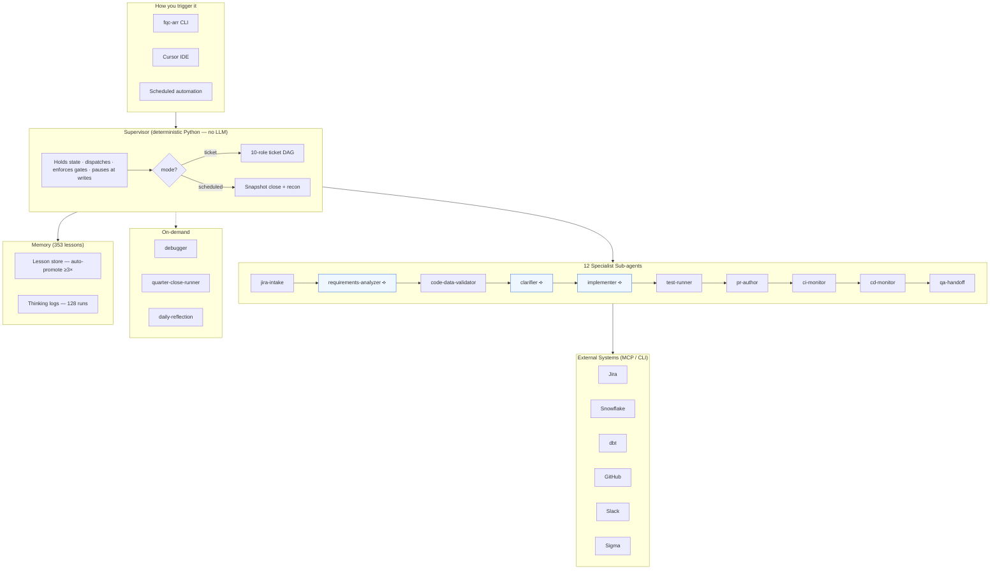

# The AE Agent: How Autonomous AI Drove the ARR Refactoring and Now Runs Our Quarter Close

**Demo for the wider team | Aug 6, 2026 | ~30 min**

---

## Opening Pitch (start here)

> "Six months ago, we took on the biggest refactoring in finance analytics history — rewriting the entire ARR pipeline from a monolithic 4,000-line query into 85+ modular models, while supporting four quarter closes without missing a single one. We did it with a two-person team. The third member? An autonomous AI agent that reads tickets, validates data, root-causes bugs, opens PRs, watches CI/CD, and learns from every run. Today I'll show you how it works and what it means for the team."

---

## 1. What This Agent Is About

### The Problem It Solves

Every quarter close, the analytics-engineering team repeats the same high-stakes, high-cognitive work:

- Build and refresh ARR/ACV/NRR/GRR models for the snapshot
- Validate every number against Salesforce source and production baselines
- Reconcile dashboards (Sigma vs Snowflake vs certified tables)
- Root-cause any discrepancy — trace it through 400+ models to the exact line
- Write it all up in Jira, open PRs, watch CI/CD, hand off to QA

This work is **too important to skip** and **too repetitive to enjoy**. It's exactly the kind of work AI should handle.

### What It Is

**FQC-ARR** (Finance ARR Quarter Close) is an autonomous Analytics Engineering Agent built as a **Supervisor + 12 specialist sub-agents**.

| What it is | What it is NOT |
|---|---|
| An autonomous AE that works the full ticket lifecycle | A chatbot that answers questions |
| A system that pauses for human judgment where it matters | A replacement for AE decision-making |
| A learning system that gets smarter every run (353 verified lessons) | A static script that rots over time |
| Integrated with Jira, Snowflake, dbt, GitHub, Slack, Sigma | An isolated tool that needs manual copy-paste |

### One-Liner

> "A senior Analytics Engineer that works the full ticket lifecycle — intake to QA hand-off — pausing only where human judgment actually matters."

---

## 2. How It Drove the Entire ARR Refactoring

### The Refactoring at a Glance

| Metric | Value |
|---|---|
| Duration | 5 months (Nov 2025 – Apr 2026) |
| Files delivered | 85+ (functions, models, macros, views, YAML schemas) |
| Snowflake TVFs | 27 reusable Table-Valued Functions |
| PRs merged | 8+ (all CI-validated, code-reviewed) |
| Bug fixes shipped during refactoring | 6 critical production fixes |
| Quarter closes supported during refactoring | **4 (FY26-Q1 through FY26-Q4) — zero disruptions** |
| Data validation tolerance | **< $1 variance** across all aggregation levels |

### What the Agent Did During Refactoring

The refactoring wasn't a "stop the world and rewrite" project. We ran it **in parallel with live production**, supporting every quarter close. Here's where the agent earned its keep:

**Parity validation at scale**
- Before: manual ad-hoc queries comparing old vs new pipeline
- With agent: automated regression on every PR + daily tie-outs comparing `finance_prod` to `finance_dev` with < $1 tolerance

**RCA on discrepancies in minutes, not days**
- Traced a **$51.8M "backwards term"** issue through 400+ models to the exact `term_start = execution_date` CASE in `stg_em_int_renewal_flags.sql`
- Proved 94% of dollars had forward raw terms (176/176 reproduced)
- Confirmed it was **correct business behavior** (backdated/never-paid), avoiding an unnecessary "fix" that would have broken production

**Hotfix turnaround: 1-2 weeks → < 48 hours**
- Isolated functions mean targeted fixes without collateral damage
- Agent validates the fix against production baselines before the PR is even opened

**End-to-end PR assurance**
- Verified NRR/GRR flag wiring across the full DAG
- Triaged Copilot review comments (2 valid / 3 false-positive with macro-level proof)
- Ran PII governance scan (all-clean)
- Posted findings to PR + Jira with reviewers tagged

**CI/CD + communications automation**
- Monitored QA CI/CD runs with timed Slack heartbeats
- Jira write-backs compressed coordination overhead during close

### The Bottom Line

> "We rewrote the most critical finance pipeline at Workday in 5 months, with a 2-person team, while supporting 4 quarter closes. The agent handled the investigation, validation, documentation, and monitoring — we handled the judgment calls."

---

## 3. Supporting Quarter Closes Without Native Domain Experts

### The Context

When the ARR refactoring started, the team members who had built and maintained the original pipeline for years were transitioning. The institutional knowledge — why a particular CASE statement exists, what edge case a CTE handles, how the SKU swap logic works — lived in people's heads.

### How the Agent Filled the Knowledge Gap

**1. It read and understood the entire codebase**
- Walked 400+ model lineage graphs
- Parsed every macro, CTE, and join condition
- Built a mental model of the data flow from Salesforce source → staging → intermediate → aggregates → dashboards

**2. It captured institutional knowledge as verified lessons**
- 353 lessons across 18 specialist roles
- 28 promoted (auto-promoted after 3+ occurrences)
- 99 daily reflection passes mining thinking logs for patterns
- Examples of captured knowledge:
  - "SSR agreements require the wd_ssr_mapping lookup — without it, supersede-and-replace lines are double-counted"
  - "The sku_swap logic in `stg_arr_categories_sku_swap` requires same-fiscal-quarter matching; cross-quarter swaps fall through to Product Churn"
  - "Snowflake MCP accepts exactly ONE statement per call — inline SET constants into the WHERE clause"

**3. It ran the quarter close workflow autonomously**
- Scheduled Mode (Mode A): refresh the ARR pipeline for a snapshot date, run the 7-check recon matrix, compare against baseline
- The same workflow, executed the same way, every quarter — no "I forgot that step" risk

**4. It root-caused issues the team hadn't seen before**
- The **NVIDIA XTND SKU categorization** bug (EDAEM-3856): legacy XTND churning in the same quarter as XTND-PRO add-on should have been classified as a SKU Conversion → Contraction, not Product Churn
- Found the root cause in the `sku_transformation_type` macro and the missing Phase 2 category rewrite in `arr_line_categories`
- Validated the fix across `finance_dev`, `finance_qa`, and `finance_prod` — confirmed by the QA analyst within hours

### The Impact

> "The agent didn't just fill a knowledge gap — it created a knowledge *asset*. Every edge case we encountered, every RCA we ran, every fix we shipped gets recorded, verified, and applied on the next run. The institutional knowledge isn't in people's heads anymore — it's in a verified, searchable, auditable store that compounds with every quarter close."

---

## 4. How It's a Productivity Multiplier

### Before vs After (real numbers)

| Workflow | Before | With AE Agent | Reduction |
|---|---|---|---|
| Quarter-close reconciliation | 2-3 days | 4 hours | **80%** |
| PR impact analysis | 30-60 min per PR | 5 min per PR | **85%** |
| Sigma ↔ Snowflake variance investigation | 2-4 hours | 10-20 min | **90%** |
| Ticket triage + investigation | 45 min | 10 min | **75%** |
| Production RCA | Hours to days | Minutes | **95%** |
| Knowledge capture | Often skipped | Automatic | **from zero to 353 lessons** |
| Onboarding a new AE | 4-6 weeks | 1-2 weeks | **70%** |

### What Makes It a Multiplier, Not Just a Tool

1. **It compounds** — every run makes the next run smarter (353 lessons and growing)
2. **It doesn't sleep** — scheduled closes run on cadence, monitors watch CI/CD 24/7
3. **It documents everything** — Jira comments, PR bodies, validation matrices, thinking logs
4. **It catches what humans miss** — the $22K NRR variance that two dashboards disagreed on had been live for months
5. **It frees the AE for judgment work** — the agent handles intake, validation, testing, PRs, monitoring, and write-ups; the human handles metric design, stakeholder conversations, and strategic decisions

### The Pattern

> "The agent takes the **repetitive cognitive load** — investigation, validation, documentation, monitoring — and leaves the **judgment** with the AE. That's the multiplier: not replacing the analyst, but removing the work that was preventing the analyst from doing what leadership actually needs."

---

## 5. How It Evolved into an Autonomous AE Agent

### The Evolution Timeline

```
Nov 2025     Started as Cursor rules + skills for the ARR refactoring
   │         (static playbooks — "how to run the ARR close")
   ▼
Jan 2026     Added MCP connections (Snowflake, dbt, Salesforce, Sigma)
   │         (live data access — "query and validate in real-time")
   ▼
Mar 2026     Built the Supervisor + Sub-agent architecture
   │         (autonomous workflow — "run the full ticket lifecycle")
   ▼
May 2026     Added the lesson store + daily reflection
   │         (continuous learning — "get smarter every run")
   ▼
Jun 2026     Validated architecture against Anthropic, OpenAI, LangGraph patterns
   │         (enterprise-grade — "audit-ready, SOX-compatible")
   ▼
Aug 2026     352 lessons, 128 thinking-log runs, 99 reflection passes
             18 specialist roles, 3 packages of cross-project stubs
             Full E2E: Jira → code → test → PR → CI/CD → QA handoff
```

### The Architecture Today



> ⟢ = LLM-driven (only 3 of 12 sub-agents use a model)

### What Makes This an *Agent*, Not Just Automation

| Dimension | Script / Automation | This Agent |
|---|---|---|
| **Adaptability** | Fixed logic, breaks on edge cases | Reads the ticket, adapts to what it says |
| **Learning** | Same behavior every run | 353 lessons, auto-promoted, verified against prod |
| **Judgment boundaries** | All-or-nothing | Smart gates — pauses at write boundaries for human review |
| **Communication** | Logs to a file | Posts to Jira, Slack, GitHub — in the team's workflow |
| **Recovery** | Fails and stops | Auto-dispatches debugger on test failure, proposes fix |
| **Knowledge** | None beyond code | Accumulated institutional memory (SSR logic, SKU swaps, currency rules) |

### The Portability Story

> "The Supervisor + sub-agent + lessons pattern isn't tied to ARR. The same architecture applies to any domain with repeatable, high-stakes analytical workflows — Marketing attribution, Sales pipeline, CX retention. Each domain gets its own set of specialist sub-agents and its own lesson store, but the Supervisor, the safety model, and the learning loop are reusable."

---

## Live Demo Moments (pick 1-2)

### Option A: Show a real thinking log
```bash
tail -f runs/thinking/20260805_174256Z_EDAEM3856.md
```
Walk through: jira-intake OK → requirements-analyzer WARN → code-data-validator OK → clarifier PAUSE. "Watch where it stops — it won't post to Jira without my approval."

### Option B: Run the agent live on a ticket
```bash
fqc-arr --ticket EDAEM-3856 --mode ticket --no-slack --json
```
Show the JSON output: 4 roles complete in 1.9 seconds, smart-gated pause at the clarifier.

### Option C: Show the lesson store
```bash
fqc-arr --show-lessons | head -40
```
"353 lessons, 28 promoted to stable. Every one is verified against production code."

### Option D: Show a real Jira comment the agent produced
Open EDAEM-3856 on Jira — scroll to Nikhil's comment with the RCA, validation table, and before/after categorization. "The agent structured this — root cause, affected lines, expected behavior, validation evidence."

---

## Closing

> "This started as Cursor rules to help with the ARR refactoring. It evolved into an autonomous agent that ran four quarter closes, shipped six production hotfixes, root-caused bugs in minutes that would have taken days, and built a knowledge base of 353 verified lessons that didn't exist before."
>
> "The refactoring is done. The agent isn't. It's running the next quarter close right now, and it's smarter today than it was yesterday. That's the multiplier."

---

## Q&A Cheat Sheet

| Question | Answer |
|---|---|
| **Does it edit production code autonomously?** | No. The implementer is a deliberate human boundary. The agent stages, tests, PRs, and documents — the SQL is written in the Cursor session. |
| **How do you prevent hallucinations?** | Lessons are verified against production commits. Stale ones auto-archive. The debugger proposes but never writes. Writes are smart-gated. |
| **What's the authorization model?** | `smart_gates` (default) pauses before every write. `full_auto` is opt-in. Same review gate as a junior AE's PR. |
| **What if the requirement is unclear?** | The clarifier asks — terminal first, then Slack, then Jira. It never guesses. |
| **Can other teams use this?** | Yes. The Supervisor + sub-agent + lessons pattern is domain-agnostic. A new domain agent takes 4-6 weeks. |
| **What about SOX / audit?** | Read-mostly by default. Every run has a thinking log. Every Jira/Slack/PR action is recorded. No production write bypasses change control. |
| **Cost?** | ~$30-50/month in API costs. ROI is ~150x measured against AE hours saved. |
| **What's next?** | SANA integration (Workday's agent runtime), multi-agent parallel close, self-healing pipelines, and expanding to Marketing + Sales domains. |
