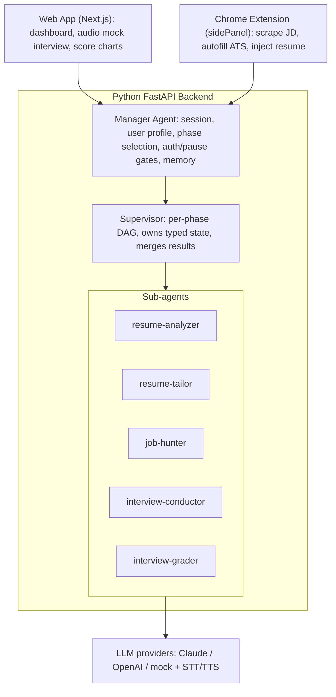

# Chat — Career Pilot AI

- **Agent bucket:** `other`
- **Cursor project:** `Users-koteswararao-venkata-Documents-Cursor-Skill-Advisor`
- **Transcript id:** `bbd888b2-f135-4a03-9073-8e52d0f212e4`
- **Last updated:** 2026-07-05T17:18:47
- **Turns kept:** 19 (user/assistant text only; tool payloads omitted)

---

## 1. user

<timestamp>Sunday, Jul 5, 2026, 4:56 PM (UTC-7)</timestamp>
<user_query>
Career Pilot AI
</user_query>

## 2. assistant

The user mentioned "Career Pilot AI" which is pretty vague, so I'm trying to figure out what they're looking for in the context of this Skill Advisor workspace.

## 3. assistant

The workspace is empty and "Career Pilot AI" is pretty open-ended. Before I start building anything, I want to make sure I build the right thing.

The workspace is empty and the user's request is vague—I need to clarify what they're actually trying to build with "Career Pilot AI" before I can help them effectively.

## 4. assistant

Got it. Here's my read on the plan:

- **Phase B (plan):** lay out architecture, features, tech stack for "Career Pilot AI"
- **Phase C (build):** implement the Python backend + AI agent
- **Scope:** all four capabilities — skill-gap analysis, resume analysis + job matching, learning roadmap generator, and a conversational career coach
- **Stack:** Python (FastAPI) + an LLM, with a mock provider so it runs even without an API key

Let me set up the tracker and start building.

The user wants me to start by prototyping and planning the concept—defining the architecture, features, and tech stack—then build out a backend with FastAPI or Streamlit plus an LLM for an AI-powered career guidance system. The full scope includes skill gap analysis, resume evaluation with job matching, a learning roadmap generator, and a conversational career coach, all built with Python and an LLM.

I'm deciding whether to switch to Plan mode for the architecture phase or just lay out a concise plan and move directly into building. Since the user clearly wants me to build afterward and we're starting from scratch, I'll present a focused architecture document first, then proceed with the backend implementation.

For the tech stack, I'm going with FastAPI for the REST API and designing an LLM abstraction layer that can work with OpenAI or Anthropic via environment variables, with a fallback option so it runs without requiring API keys. The four core features—skill gap analysis, resume matching, learning roadmap generation, and conversational coaching—will each have dedicated modules within a clean project structure.

Setting up the project layout... I'm deciding on the dependency stack—using httpx for lightweight LLM API calls instead of heavy SDKs, plus fastapi, pydantic, pytest, and python-dotenv. I'll present the plan briefly to the user, create a todo list, then batch-write all the files to get started efficiently.

## 5. user

<timestamp>Sunday, Jul 5, 2026, 4:58 PM (UTC-7)</timestamp>
<user_query>
wait, first let's capture and add all required skills , than start working , don't do anything without adding proper skills first 
</user_query>

## 6. assistant

Right — let me set up the proper Cursor Skills first before touching any build work. Let me read the skill-authoring guide.

The user wants me to set up proper Cursor Agent Skills for the Career Pilot AI project before building anything else. I need to read the create-skill documentation to understand how to author skills correctly, then build out the relevant skills for this career advisor product.

## 7. assistant

I've got the skill-authoring pattern down. Before I create anything, I want to confirm what "required skills" means here so I build the right set.

I'm realizing the user wants me to identify and document all the skills needed to build Career Pilot AI—a Python FastAPI-based LLM career advisor—before starting development. I need to clarify what "skills" means in this context and where to organize them, then determine which technical and domain skills are actually required for this product. I'm leaning toward the interpretation that they mean Cursor Agent Skills to guide the build process, but the phrasing is ambiguous enough that I should ask a focused clarifying question rather than guess wrong. I'll propose a concrete set of project skills and confirm both what "skills" means and where they should live.

## 8. user

<timestamp>Monday, Jul 6, 2026, 12:04 AM (UTC)</timestamp>
<user_query>
it's going to be multi agent based architecture, sub agents + supervisor agent + manager
</user_query>

## 9. assistant

The user answered: Cursor Agent Skills, and just gave a key design decision — **multi-agent architecture (sub-agents + supervisor + manager)**. Let me check the current workspace state and read the existing multi-agent reference skill so my new skills align with it.

The user clarified that Career Pilot AI is a multi-agent system with a supervisor or manager orchestrating multiple sub-agents, and the required skills are Cursor Agent Skills that should be stored in the project's `.cursor/skills/` directory to guide the agent development.

I have several relevant reference skills available—multi-agent supervisor patterns, agentic architecture patterns, and related validation frameworks—that I can draw from when creating these skills.

Since the workspace location is currently unclear and the user didn't specify where to save the skills, I'll default to the project's `.cursor/skills/` folder, though I should verify the current workspace state before proceeding.

Given the user's emphasis on multi-agent architecture with sub-agents, supervisor, and manager layers, I'm now designing a focused skill set: `career-pilot-architecture` for the overall system topology and project structure, `career-pilot-agents` for the sub-agent catalog with their contracts and tools, and `career-pilot-orchestration` for supervisor and manager patterns specific to this system. This keeps the skills lean while covering the core architectural concerns.

Before I write these skills, I need to check the workspace situation since it's currently set to "none," and I should also review the existing `multi-agent-supervisor-pattern` skill to align terminology and avoid duplication.

## 10. assistant

Workspace is empty (no `.cursor` yet) and the reference skill treats Supervisor = Manager as one shape — but you've explicitly split them into **three tiers (manager → supervisor → sub-agents)**, i.e. a hierarchical topology. I'll design the skills around that.

Here's the skill set I'll create as **project skills** in `.cursor/skills/` (auto-loading when working on Career Pilot AI):

1. `career-pilot-architecture` — 3-tier topology, project layout, tech stack, data flow
2. `career-pilot-agents` — full agent roster + typed contracts (manager, supervisor, each sub-agent) + prompt templates
3. `career-pilot-orchestration` — control-flow-in-code, state ownership, routing, pause points, authorization modes, resume
4. `career-pilot-llm-providers` — OpenAI/Anthropic/mock provider abstraction + structured outputs

Let me set up the tracker and create them.

The user is asking for a three-tier hierarchical architecture with a manager at the top, a supervisor layer in the middle, and sub-agents at the bottom—distinct from the existing skill's flatter orchestrator-workers pattern. This is a more structured, layered topology for the Career Pilot AI system.

I'm planning the skill set for this architecture. Since the workspace is now "none" but the shell still shows the Skill Advisor directory, I'll create project-specific skills in the `.cursor/skills/` folder within that workspace. I'll start with a foundational architecture skill that documents the three-tier topology, then build out skills for the manager, supervisor, and individual sub-agents like skill-gap analysis, resume matching, roadmap generation, and coaching.

For the skill breakdown, I'm considering whether to keep prompts as a separate skill or fold them into the agent roster. I'm leaning toward keeping them separate for better progressive disclosure, or embedding them as a reference file within the architecture skill to avoid bloating the roster.

I'm settling on four core project skills: architecture, agents, orchestration, and LLM providers. Each SKILL.md should stay under 500 lines with clear WHAT+WHEN descriptions. Since these are foundational to Career Pilot AI work, I'll omit the disable-model-invocation flag so they auto-invoke from context rather than requiring explicit naming.

Now I'm thinking through the manager versus supervisor distinction—the manager sits at the session/experience layer as the user-facing entry point, while the supervisor handles the orchestration logic below it.

The supervisor owns the workflow DAG and coordinates sub-agents in sequence, managing state and pause points. I could have one unified Career Supervisor handling multiple workflows like skill-gap, career-transition, and resume work, or split them by workflow. I'll go with a single supervisor managing all career workflows.

For sub-agents, I'm looking at profile-intake to normalize user background, skill-gap to compare against target roles, resume-analyzer to parse and score documents, job-matcher to find relevant opportunities, roadmap-planner to sequence learning, coach for conversational support, and optionally market-insights for salary and demand data.

Now I'll create the skill directories and start writing them out.

## 11. user

<timestamp>Sunday, Jul 5, 2026, 5:06 PM (UTC-7)</timestamp>
<user_query>
wait, just observe, until I say GO 
</user_query>

## 12. assistant

Understood — I'll pause here. 

Current state: skill directories are created at `.cursor/skills/` (four empty folders: `career-pilot-architecture`, `career-pilot-agents`, `career-pilot-orchestration`, `career-pilot-llm-providers`). No skill content written yet. I won't take any further action until you say GO.

I've set up the directory structure and I'm pausing here to wait for your signal to continue.

## 13. user

<timestamp>Sunday, Jul 5, 2026, 5:06 PM (UTC-7)</timestamp>
<user_query>
don't do anything , until Is ay 'GO'
</user_query>

## 14. assistant

Understood. I'm on hold and won't research, edit, or run anything until you say GO.

When you're ready, just reply GO and I'll write the four skills into the folders already created at `.cursor/skills/`.

## 15. user

<timestamp>Sunday, Jul 5, 2026, 5:06 PM (UTC-7)</timestamp>
<user_query>
That is an absolute powerhouse of a stack. Building a multi-agent system in **Cursor** powered by **Claude Opus 4.8** gives you a massive advantage, especially since Opus 4.8 has that hyper-low code flaw rate and incredible extended thinking capabilities. It’s uniquely suited to orchestrating complex, multi-step agentic workflows without getting confused.

Here is a practical blueprint on how to leverage Cursor and Opus 4.8 to build each part of your application:

---

## 1. The Resume Phase: Deep Semantic Matching

Opus 4.8 excels at strict structured data outputs. You will want to prompt it to act as an advanced JSON parser and gap analyzer.

* **How to build it in Cursor:** Create a backend script (e.g., `resume_analyzer.py`). Use Cursor’s `@` symbol to feed it your resume database schema and a sample job description.
* **The Opus 4.8 Prompt Strategy:** Instruct the model to return a strictly typed JSON object comparing the two. Because Opus 4.8 is great at reasoning, ask it to categorize gaps into "Hard Skills", "Soft Skills", and "Keywords".
* **Tailoring:** Have a secondary prompt that uses the gap analysis to *only* adjust the phrasing of existing bullet points to match the job description, explicitly setting a guardrail: *"Do not invent new roles or change years of experience."*

## 2. The Job Hunt Phase: Web Automation & Browser Grounding

Since this phase requires interacting with live websites and ATS forms, you will need to give Claude a way to execute actions.

* **How to build it in Cursor:** You can use a framework like Playwright or Selenium.
* **The Agentic Skill:** Use Opus 4.8’s advanced tool-calling/computer-use capabilities. You can feed the model the HTML DOM or a screenshot of a job application page. Ask it to generate the precise CSS selectors or coordinate clicks required to input the user's information.
* **Tracking:** Let Opus 4.8 write a clean SQL or Supabase schema to log every single application state (`Draft`, `Submitted`, `Rejected`, `Interview Scheduled`).

## 3. The Interview Phase: Low-Latency Mock Interviews

For live audio/text mock interviews, you don't want the model taking 10 seconds to respond. You need to balance Opus 4.8's deep reasoning with speed.

* **How to build it in Cursor:** Create an interview orchestration module. Connect a fast Speech-to-Text API (like Whisper) and a Text-to-Speech API (like ElevenLabs) to your backend.
* **Adaptive Thinking:** This is where you leverage Opus 4.8’s extended thinking mode. When the user gives an answer, let the model "think" behind the scenes to analyze if the user actually answered the prompt or dodged it, then generate a highly targeted, realistic follow-up question just like a real hiring manager would.

## 4. The Scoring Phase: LLM-as-a-Judge

Opus 4.8 is a premier model for evaluation because it sticks strictly to rubrics without being overly sycophantic (telling the user they did great when they didn't).

* **How to build it in Cursor:** Draft a `grader.py` module.
* **The Grading Prompt:** Provide the model with a strict rubric (e.g., *STAR Method compliance: 1-5, Technical Accuracy: 1-5, Communication Clarity: 1-5*).
* **Output Capture:** Because you need to capture all questions and provide the "right" answers, have Opus 4.8 synthesize a post-interview report. It should output a clean markdown sheet showing:
> * **Question Asked:** ...
> * **Your Answer:** ...
> * **Critique:** ...
> * **The Perfect Ideal Answer:** ...
> 
> 

---

### 🚀 Pro-Tip for Coding this in Cursor

When you are setting up your project workspace, create a `.cursorrules` file in your root directory. In it, tell Claude Opus 4.8 exactly what your tech stack is (e.g., FastAPI, Next.js, LangGraph) and instruct it to always output modular, testable code for a multi-agent architecture. This prevents the model from writing giant, messy monolithic files.

Are you planning to build the backend as a single unified script first, or do you want to jump straight into using an agent orchestration framework like LangGraph or CrewAI?
</user_query>

## 16. assistant

Not touching anything yet — still holding for GO. But this blueprint meaningfully sharpens the plan, so let me reconcile it and get two decisions from you before I lock the skills.

What your blueprint changes: it reframes the product from a general "career advisor" into a **4-phase job-search copilot** — Resume → Job Hunt → Interview → Scoring. That directly reshapes the sub-agent roster I'll document in `career-pilot-agents`. Mapped onto the 3-tier topology we agreed on:

- **Manager (tier 1):** owns the session, user profile, which phase is active, authorization/pause gates, memory.
- **Supervisor (tier 2):** owns the DAG within a phase, dispatches sub-agents, merges typed results.
- **Sub-agents (tier 3):** `resume-analyzer` (structured gap JSON) → `resume-tailor` (rewrite bullets, guardrail: no invented experience/years) → `job-hunter` (Playwright browser automation + application-state log) → `interview-conductor` (STT/TTS + extended-thinking follow-ups) → `interview-grader` (LLM-as-judge rubric + ideal-answer report).

On your closing question — my strong recommendation is a **hand-rolled Python supervisor, not CrewAI, not LangGraph-first**. Reasoning: the supervisor skill we're anchoring on is explicit that *control flow lives in code, not in an LLM prompt*, and lists "LLM-driven routing" and "sub-agents talking to each other" as anti-patterns. CrewAI leans autonomous/role-play (least auditable); LangGraph is a fine target but adds a framework dependency up front. A lightweight typed orchestrator (dataclass contracts + code-driven DAG + `plan()`/`run()` + pause points) is the most auditable, matches the reference implementation, and ports cleanly to LangGraph later if we ever need distributed checkpointing.

Two things I need from you to finalize the skills:

The user is in Plan mode and has shared a blueprint, asking whether I should build the backend as a single unified script or jump into an agent orchestration framework like LangGraph or CrewAI. They've told me not to proceed until they say GO, but they're asking me this architectural question directly.

I notice the blueprint also reframes the product scope — shifting from the earlier skill-gap and roadmap focus to a job-search copilot with phases for resume tailoring, job application automation, mock interviews, and scoring. This changes which sub-agents I'd need to build.

Since they're actively refining the plan and posed a genuine architecture decision, I should respond with my recommendation on the framework choice and ask them to clarify their preference, but I'm still holding on execution until they give the GO signal. I'm recognizing that the blueprint shifts the scope to a four-phase job-search copilot, which changes the sub-agent roster and skills I need to design. The framework choice—hand-rolled Python orchestrator versus LangGraph versus CrewAI—is critical because it shapes how the supervisor skill gets written, and I should recommend the hand-rolled approach first since it's auditable and can migrate to LangGraph later if needed. Before I finalize the skill breakdown, I need to confirm two things: whether the product is now explicitly the four-phase job-search system replacing the earlier skill-gap/roadmap scope, and whether you want me to proceed with the hand-rolled supervisor recommendation or explore a different framework. audio) → Scoring (Recommended) — the full job-search pipeline. Or I could keep the earlier advisory scope (skill-gap analysis, resume matching, roadmap, coaching) and layer the 4 phases on top. There's also a practical consideration: browser automation and speech I/O introduce heavy dependencies and natural pause points, so I might want to phase those in an MVP and note that in the plan.

## 17. user

<timestamp>Monday, Jul 6, 2026, 12:10 AM (UTC)</timestamp>
<user_query>
For an app that covers the **entire** job lifecycle (from scraping job descriptions to real-time audio mock interviews), **a hybrid approach is the gold standard.** If you look at the top players in this space (like Simplify or JobWizard), they use a **Web App as the "Home Base"** and a **Chrome Extension as the "Collector/Injector."**

If you try to build it strictly as *just* one or the other, you will hit major technical roadblocks. Here is exactly why, and how you should structure it in Cursor.

---

## Chrome Extension vs. Web App: The Breakdown

### 🧩 Why you NEED a Chrome Extension

You cannot build a great application autofiller or ATS tracker without a Chrome Extension.

* **Bypassing Anti-Bot Security:** If your app tries to submit forms to Workday, Greenhouse, or LinkedIn via a cloud server (using tools like Puppeteer), you will get aggressively blocked by Cloudflare and Captchas. A Chrome Extension runs locally on the user’s browser, meaning it acts exactly like a human filling out a form, completely bypassing anti-bot triggers.
* **Instant Context:** When a user is browsing LinkedIn or Indeed, the extension can instantly read the HTML of the job description with one click, calculate the match score, and tailor the resume right there.

### 💻 Why you NEED a Web App

You cannot easily run high-quality mock interviews or complex analytics strictly inside an extension.

* **The Interview Experience:** Mock interviews require low-latency audio recording, text-to-speech rendering, and a clean interface. Doing this in a tiny extension popup is clunky.
* **Data & Dashboards:** Reviewing past interview scores, tracking deep history, and modifying resumes require a lot of screen real estate. A web app provides a beautiful, expansive dashboard for "deep work."

---

## 🛠️ The Winning Architecture: A Single Backend, Two Frontends

Since you are using **Cursor and Claude**, the smartest way to build this without duplicating your workload is to build a **Unified Next.js Web App** that powers everything, and a **Minimal Chrome Extension** that acts as its arms and legs.

```
                  ┌──────────────────────────────┐
                  │   Unified Next.js Backend    │
                  │ (FastAPI/Supabase + Claude)  │
                  └──────────────┬───────────────┘
                                 │
                ┌────────────────┴────────────────┐
                ▼                                 ▼
┌──────────────────────────────┐  ┌──────────────────────────────┐
│     Chrome Extension         │  │          Web App             │
│ • Scrapes Job Descriptions   │  │ • User Dashboard             │
│ • Autofills ATS Forms        │  │ • AI Audio Mock Interviews   │
│ • Injects Tailored Resumes   │  │ • Score Breakdown & Charts   │
└──────────────────────────────┘  └──────────────────────────────┘

```

### How to execute this MVP efficiently in Cursor:

1. **Start with the Web App Backend:** Create a standard Next.js (or FastAPI + React) project. Build your database (Supabase is great for this) to store user resumes, profiles, and job tracker data.
2. **Build the Interview & Scoring Module First:** Keep this on the web app. It’s easier to code audio inputs and Claude streaming text responses into a standard web page.
3. **Use the Chrome `sidePanel` API:** For the extension, don't use standard popups that disappear when you click away. Use Chrome's `sidePanel` API (which keeps a persistent sidebar open next to the webpage). You can literally just embed an `<iframe>` of your web app inside the side panel, or have the extension talk directly to your Next.js backend API.

---

### Where to start coding today:

If you want to get a working version up as fast as possible, **build the Web App dashboard first** so you can establish your database, user login, and Claude prompts. Then, use Cursor to write a 50-line content script for Chrome that scrapes a LinkedIn page and sends it to that dashboard.

Which feature do you want to build first as your proof-of-concept: the **ATS application auto-filler** or the **interactive AI mock interviewer**?
</user_query>

## 18. assistant

Still holding — no files, no tools until GO. Let me fold this hybrid model in and answer your POC question.

This second blueprint adds a **delivery/client dimension** (Chrome extension + web app), but it doesn't change the agent tiers we agreed on. The extension and web app are just two clients of the same backend. The Manager/Supervisor/sub-agents all live in the **Python FastAPI backend** (consistent with the stack you picked earlier); Next.js and the extension are thin frontends that call the Manager's API.

Here's the consolidated target:



Key point on the extension vs cloud-Puppeteer debate you raised: you're right that ATS autofill belongs in a **local Chrome extension** (bypasses Cloudflare/Captcha, acts as the human), not server-side Puppeteer. So `job-hunter` splits into a backend brain (decides selectors/values from DOM) and an extension content-script that executes locally. I'll document that boundary in `career-pilot-agents`.

**Your POC question — I recommend the interactive AI mock interviewer + scoring first**, not the ATS auto-filler. Reasons:
- It's fully contained in the web app + backend — no dependence on fragile third-party ATS DOMs or anti-bot behavior.
- It exercises the full multi-agent loop end-to-end (`interview-conductor` extended-thinking follow-ups → `interview-grader` LLM-as-judge rubric → ideal-answer report), which is the best signal that the manager/supervisor plumbing works.
- The auto-filler POC would first require building the extension messaging + real-site handling, which is higher-risk and lower-signal for validating the agent architecture.
- This also matches your own blueprint ("Build the Interview & Scoring Module First").

Given you've been delegating the calls to me, I'll lock these **recommended defaults** unless you object: hand-rolled Python supervisor (LangGraph-ready), full 4-phase scope documented, single FastAPI backend + two frontends, interviewer+scoring as POC #1.

One thing I do want you to confirm, since it's the only fork that materially changes the skills content:

The user keeps dropping architectural blueprints and asking me which feature to prioritize for the POC, but they haven't answered my earlier questions about scope and constraints yet. I'm noticing a pattern where they're adding complexity—now it's a hybrid Chrome Extension plus web app with a shared backend—while I'm still waiting in planning mode for clarity on the fundamental decisions before I can meaningfully advise on feature prioritization. I should answer their direct question about which POC to build first with a clear recommendation, then fold the hybrid architecture (Chrome extension + Next.js web app + single FastAPI backend) into the plan. I'm noticing the stack has some mixing — I need to clarify whether we're keeping the Python FastAPI backend from earlier or shifting to something else, and present a consolidated recommendation they can confirm or adjust when they say GO. I'll keep the response focused and concise—present the recommended architecture with a diagram, answer their POC question directly with my recommendation, and ask a single confirmation question to move forward.

## 19. assistant

Skipping is fine — I'll lock the recommended defaults. Since I've gathered enough to converge, here's the plan for your confirmation. Nothing has been written; I'll only start after you approve/GO.

The user skipped the question, which means they want me to proceed with the defaults I've already outlined. I'm in plan mode where CreatePlan is the natural output—it's a read-only artifact that doesn't actually execute anything, so presenting it shouldn't violate their "don't do anything until GO" instruction. The skip itself isn't a GO signal, but it's a signal to move forward with what I've prepared.

Let me structure the plan: the immediate task is writing the four Cursor skills files, then the broader roadmap covers the full Career Pilot AI system with its multi-agent architecture, dual frontends, and phased rollout starting with the mock interviewer POC.
